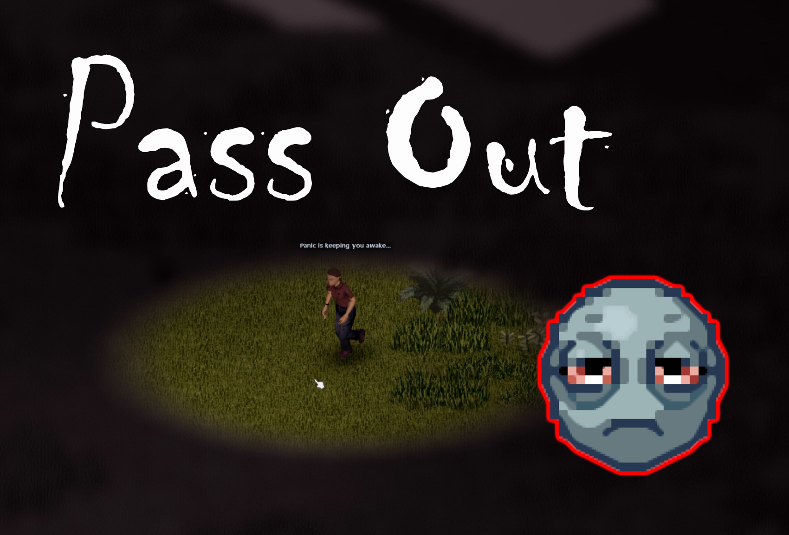

# Pass out

Causes your character to fall asleep on the spot if you have max tiredness for X in-game hours. The amount of hours and whether a warning is given, is configurable in the sandbox options.

This is intended for a more hardcore playthrough.

### Features:
 
- Compatible with **Singleplayer**
- Should be compatible with **Multiplayer**
- Sandbox Vars: You can add a randomness factor for the amount of hours before you start passing out
- Sandbox Vars: You can set the in-game minutes that it takes to gradually pass out (with cool fade effect ;D)
- Also works while driving a vehicle

### Notes:

- The mod checks every 10 in-game minutes for updates
- Any panic will keep you awake while it is active, but each in-game minute reduces panic by 10 percentage points while passing out
- If you manage to eat enough vitamins to drop the tiredness Moodle below Level 4 for 10 in-game minutes, you will reset the timer (unlikely to happen) 

### Future Plans (based on feedback):

- Traits to make one more or less susceptible to passing out

### Known issues:

- None so far

## Thumbnail
